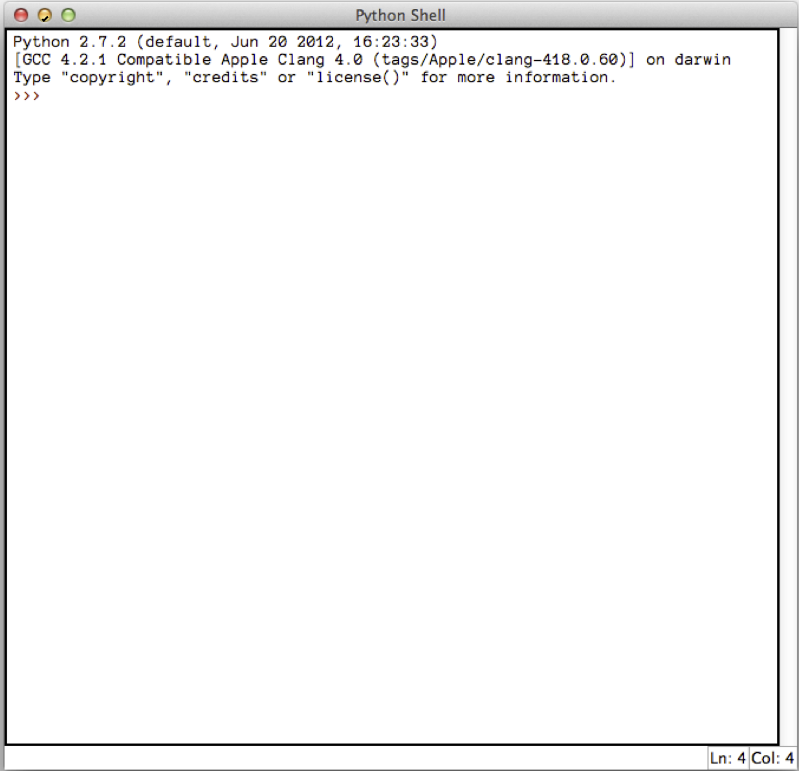

## Let's code!

---

### Launching Python


---

### Launching Python



---

Let's try this together:

```python
print("Hello World")
```

---

## Turtles

---

Let's make a turtle to draw for us:

```python
import turtle
fred = turtle.Pen()
```

---

### Turtles can draw!

<pre><code class="python fragment">
fred.forward(50)
</code></pre>
<pre><code class="python fragment">
fred.left(90)
</code></pre>
<pre><code class="python fragment">
fred.forward(50)
</code></pre>

---

What do you think this will draw?

```python
fred.forward(50)
fred.left(90)
fred.forward(50)
fred.left(90)
fred.forward(50)
fred.left(90)
fred.forward(50)
fred.left(90)
```

---

### Changing color

<pre><code class="python fragment">
fred.reset()
</code></pre>
<pre><code class="python fragment">
fred.color("red")
</code></pre>
<pre><code class="python fragment">
fred.forward(50)
</code></pre>

---

### Circles
<pre><code class="python fragment">
fred.circle(100)
</code></pre>
<pre><code class="python fragment">
fred.circle(-100)
</code></pre>

---

### Picking up and putting down the pen
```python
fred.forward(50)
fred.up()
fred.forward(50)
fred.down()
fred.forward(50)
```

---

## Summary

```python
fred.forward(100)
fred.left(90) or fred.right(90)
fred.circle(100)
fred.color("red")
fred.reset()
fred.up() or fred.down()
fred.width(5)
```

---

## Loops

Loops are for doing something over and over.

* Counting loops
* Conditional loops

---

Remember how we drew a square?
```python
fred.forward(50)
fred.left(90)
fred.forward(50)
fred.left(90)
fred.forward(50)
fred.left(90)
fred.forward(50)
fred.left(90)
```
8 lines of code and lots of repeating!

---

Here's how we would do it with a loop:
```python
for i in range(4):
    fred.forward(50)
    fred.left(90)
```
We changed 8 lines into only 3!

---

Another example:
```python
for i in range(8):
    fred.forward(100)
    fred.left(225)
```
