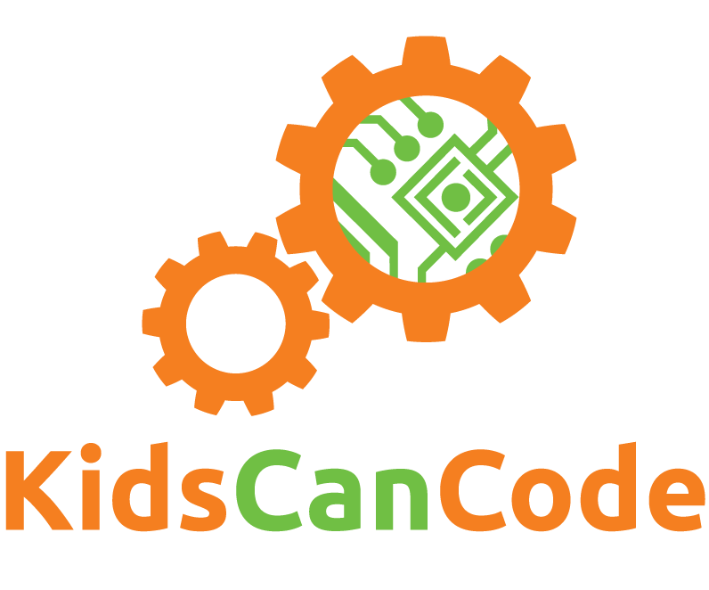

# Every Kid Should Learn to Code

Chris Bradfield

Founder, KidsCanCode

chris@kidscancode.org

---

## I think that everybody in this country should learn how to program a computer because it teaches you how to think.

Steve Jobs

---

## About me

* 25 years in the Internet technology space
* Started programming when I was 12
* Developer, Sysadmin, Manager, Consultant
* Started KidsCanCode in 2013

---

## What this talk is about

* What is programming?
* Why should you learn to code?
* Let's code!
