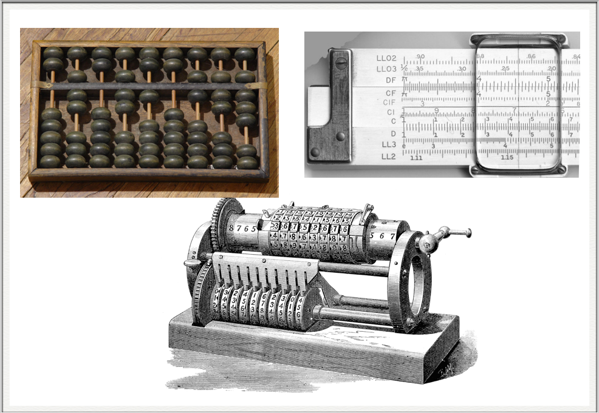
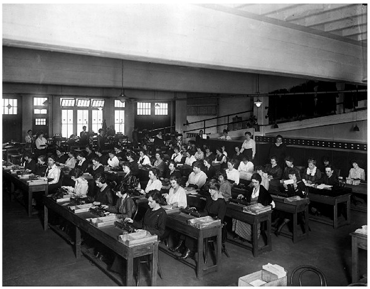
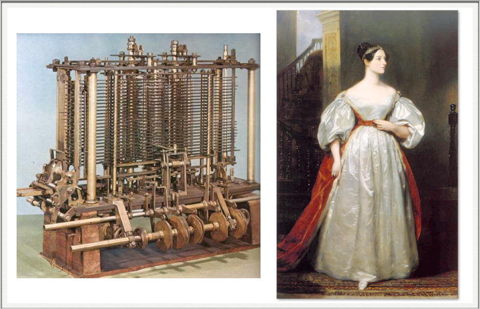
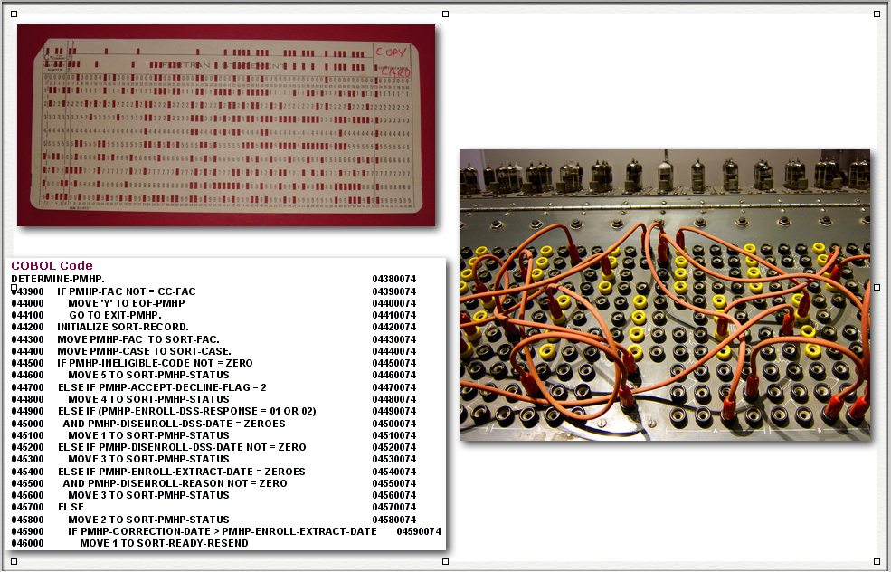
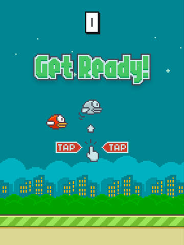
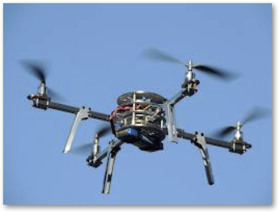
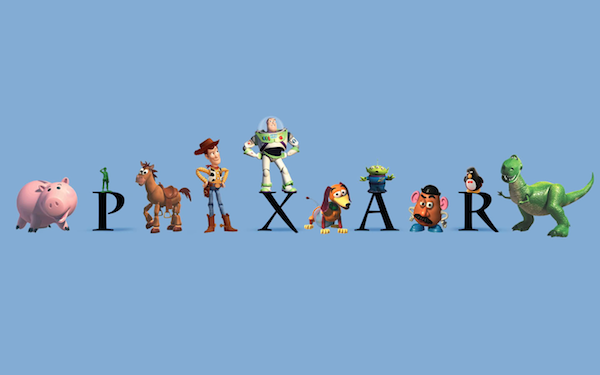
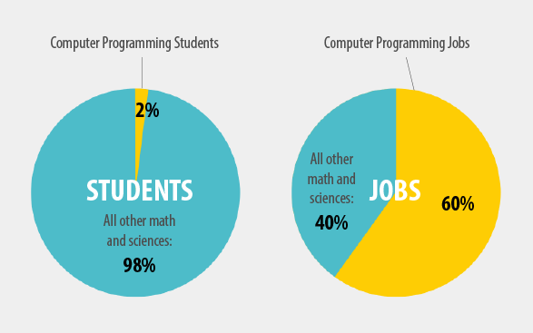
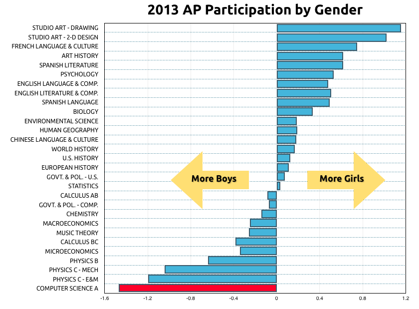
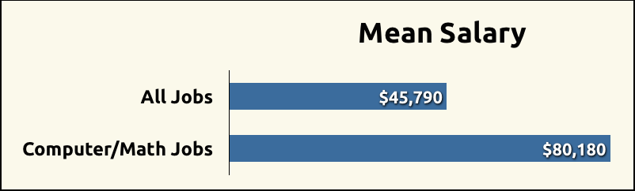

## What is programming?

---

A program is a detailed set of instructions telling a computer exactly what to do.

---
## What is computer science?

---

Computer Science is the study of computation.

---

Computers are the tools used by computer scientists.

Code is the language used to "talk" to computers.

---

### Computers in History

---

### Computers in History

---

### Ada Lovelace (1815-1852)

---

### Talking to computers

---

## Modern programming languages

* Python
* Java
* C
* C++
* Javascript
* Many more...

---

## Why should kids learn to code?

---

* Why learn science?
* Scientific method = way of thinking

---

## Coding empowers

Learning to code changes your relationship with technology.

---

## Coding empowers

| Not just...   |   |   |  But also...  |
| ------------- | - | - | ------------- |
| read          |   |   |   write       |
| use           |   |   |   understand  |
| consume       |   |   |   create      |
| technology    |   |   |   ideas       |

---

## Coding is a life skill

Coding teaches <strong>logic</strong> and <strong>problem solving</strong> skills that are useful in all areas of life.

---

## It's not just for engineers

Tomorrow's doctors, lawyers, and politicians will need to understand technology to guide future policies.

---

## Start early

The best way to become a good programmer is to practice!

---

## Fun!

Coding is fun!

---

## What do programmers make?

* Robots
* Smartphones
* Games
* Animation/Movies

---

## We need programmers

<small>Source: code.org</small>

---

### We especially need more girls in technology

<small>Source: http://media.collegeboard.com/digitalServices/pdf/research/2013/Program-Summary-Report-2013.pdf </small>

---

## Coding is a great career choice

<small>Source: http://www.bls.gov/oes/current/oes_nat.htm</small>

---

## Opportunity is scarce

<small>Source: code.org</small>

---

## kidscancode.org
