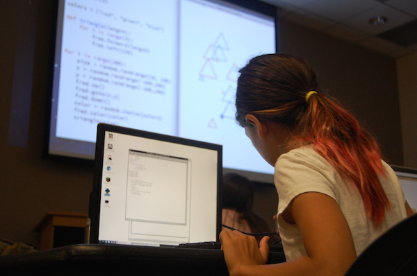
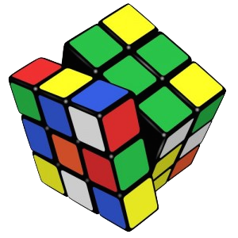
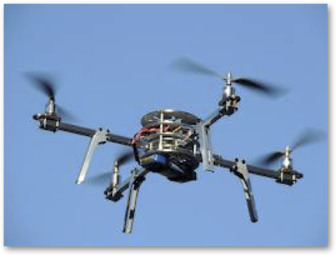
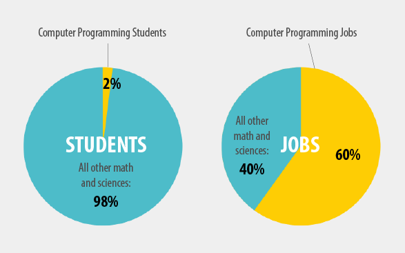
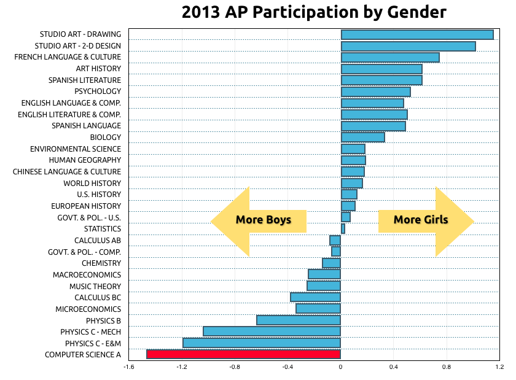
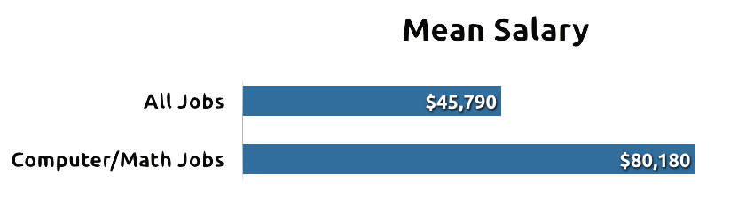

---


## I think that everybody in this country should learn how to program a computer because it teaches you how to think.

<p align="right">Steve Jobs</p>

---

## Code = Create

Learning to code changes your relationship with technology from passive consumer to active creator.

---

## Coding is a life skill

Coding teaches logic and problem solving skills that are useful in all areas of life.



---

## It's not just technical

Tomorrow's doctors, lawyers, and politicians will need to understand technology to guide future policies.

---

## Start early

The best way to become a good programmer is to program A LOT!

---

## Fun!

Coding is fun!

---

## What do programmers make?



* Robots
* Smartphones
* Games
* Animation/Movies

---

### We need programmers



<small>Source: code.org</small>

---

### We especially need more girls in technology



<small>Source: http://media.collegeboard.com/digitalServices/pdf/research/2013/Program-Summary-Report-2013.pdf </small>

---

## Coding is a great career choice



<small>Source: http://www.bls.gov/oes/current/oes_nat.htm</small>

---

## Opportunity is scarce


<small>Source: code.org</small>


---

## Scratch - for young children

* No typing
* Drag-and-drop program blocks
* Create interactive stories, animations, games, and more
* Created at MIT


---

# Python


* Great language for beginners
* Widely used in academia and industry
* Widely used in scientific computing
* Easy to read:

```python
name = input("What's your name? ")
print("Hello", name)
```

---

## kidscancode.org
